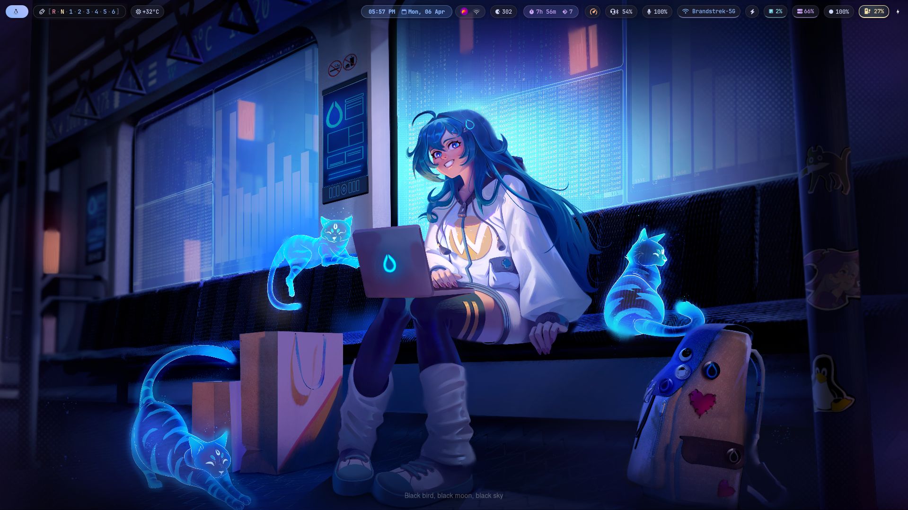

# 🌌 Celestial Stars Waybar Theme

A premium, modern, and visually stunning Waybar configuration designed for Hyprland/Wayland environments. This theme features a "Floating Islands" aesthetic with glassmorphism, glowing effects, and a unique "Celestial Cosmic" dashboard.



## ✨ Features

- ⏱ **Dev Productivity Tracker**: Real-time coding time and git commit count today.
- ⚙️ **Gear Shifter**: Workspace indicator with a gated shifter design.
- 🚀 **Turbo Boost**: Real-time disk I/O monitoring with a performance-oriented gauge.
- 🌡 **System Health Cluster**: CPU, GPU, and RAM monitoring with a car-dashboard aesthetic.
- ⛈ **Weather Infotainment**: Interactive weather card with hourly forecasts and conditions.
- 🔋 **Battery Liquid Gauge**: Fluid animation representation for battery levels.
- 🌐 **Network RPM Gauge**: High-tech network throughput monitoring.

## 🛠 Prerequisites

Ensure you have the following installed on your system:

- **Waybar**: The main bar component.
- **Python 3**: For running most of the custom monitoring scripts.
- **Nerd Fonts**: (e.g., `JetBrainsMono Nerd Font` or `Inter`) for the icons and typography.
- **Utility Tools**: `hyprland`, `jq`, `nm-applet`, `pavucontrol`, `wlogout`.

## 🚀 Installation

1.  **Clone or Copy files**:
    Copy all `.py`, `.sh`, `config.jsonc`, and `style.css` files to your Waybar configuration directory:
    ```bash
    mkdir -p ~/.config/waybar
    cp ./* ~/.config/waybar/
    ```

2.  **Make Scripts Executable**:
    Run the following command to ensure all custom modules can be executed:
    ```bash
    chmod +x ~/.config/waybar/*.py
    chmod +x ~/.config/waybar/*.sh
    ```

3.  **Run Waybar**:
    Launch Waybar with your new configuration:
    ```bash
    waybar
    ```

## 📊 Dev Productivity Tracker

The custom Dev Productivity Tracker monitors your coding activity automatically.

-   **Search Path**: It scans your home directory for git repositories up to level 5 (excluding common noise folders like `.cache` and `node_modules`).
-   **IDE Detection**: It tracks the uptime of common editors including `Code`, `NVim`, `PyCharm`, and `Antigravity`.
-   **Interval**: Refreshes every 30 seconds for accurate, real-time feedback.

---

### 🎨 Customization

You can tweak the colors and effects in `style.css` to match your own wallpaper or mood. The theme uses **CSS Gradients** and **Box Shadows** extensively for its premium look.

Enjoy your cosmic desktop experience! 🚀
